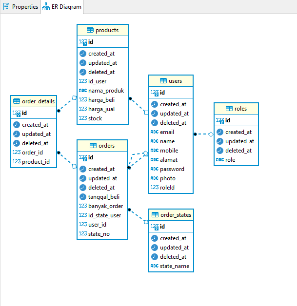

# Aneka Kios Test

This repository use Golang and docker-compose
You can use this API for Kios

## How to Use
1. Use API using `https://anekapay.herokuapp.com/`

## API
1. POST `/auth/v1/login`
2. POST `/auth/v1/signup`
3. GET `/user/v1/{id}` for get user by ID
4. GET `/user/v1/` for get all users
5. PUT `/user/v1/{id}` for edit user
6. DELETE `/user/v1/{id}` for delete user
7. POST `/product/v1/create` for create product
8. GET `/product/v1/{id}` for get Product by ID
9. GET `/product/v1/` for get all Product
10. DELETE `/product/v1/{id}` for delete product
11. POST `/kulak/v1/kulak` for kulak

## DATABASE ARCHITECTURE

## STEP Using Application
you can add product for distributor, login using distributor
Kulak using user role user or pembeli

## Seeder
Distributor `{"email":"afiflampard09@gmail.com", "password":"1234"}`
User `{"email":"afiflampard32@gmail.com", "password":"1234"}`
Pembeli `{"email":"afiflampard132@gmail.com", "password":"1234"}`

## DEVELOPER
Maintenance : AFIF MUSYAYYIDIN
